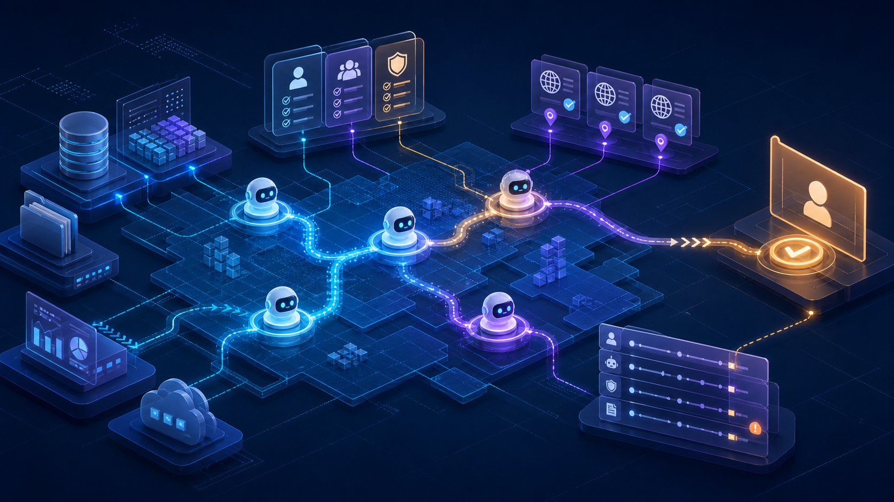

# Agentic Enterprise를 읽는 법: AI Agent는 왜 데이터·권한·감사의 문제가 되었나

> **문서 유형**: 기술 동향 해설 · 근거 기반 블로그 초안  
> **대상 독자**: AI agent 도입을 검토하는 기술 리더, 데이터/보안/플랫폼 담당자  
> **핵심 질문**: “Agent를 잘 만드는 것”보다 “Agent가 무엇을 보고, 어떤 권한으로, 어떤 근거를 남기며 실행하는가”가 왜 중요해졌는가?



> **대표 이미지 설명**: 어두운 엔터프라이즈 데이터 지도 위에서 여러 AI agent 노드가 이동하고, 경로가 권한 카드·공개 근거 URL·감사 로그·사람 승인 지점으로 연결되는 추상 기술 일러스트. 로고, 읽을 수 있는 텍스트, 실존 인물은 넣지 않았다.

## 빠른 결론

| 질문 | 답 | 근거 수준 |
|---|---|---|
| Agentic Enterprise는 이미 확정된 표준인가? | 아니다. 여러 공개 자료에서 관찰되는 전환 신호로 보는 것이 안전하다. | 해석 + 공개 기사 |
| 핵심 기술 쟁점은 무엇인가? | 데이터 맥락, 권한 위임, 감사 가능성, 출처 신뢰도다. | 공개 이벤트/기사 + 해석 |
| 조직이 먼저 설계해야 할 것은? | agent identity, permission, evidence trail, human stop point다. | 보안/거버넌스 자료 + 해석 |

## 읽는 순서

1. **근거 범위**에서 이 글의 안전한 주장 범위를 확인한다.
2. **왜 지금인가**에서 Google Cloud Next, Gartner, Citi Arc 신호를 연결한다.
3. **논증 흐름**에서 관찰·메커니즘·긴장·반론·판단을 따라간다.
4. **근거 표**에서 각 주장의 출처와 confidence를 확인한다.
5. **기술 체크리스트**를 도입 검토 질문으로 재사용한다.

## 한눈에 보는 구조

```text
공개 신호
  ├─ Google Cloud Next: agent platform / data cloud
  ├─ Gartner: agent-centric operating model 해석
  └─ Citi Arc: 금융권 내부 agent platform 사례
        ↓
기술 쟁점
  ├─ 데이터 맥락: catalog / semantic layer
  ├─ 권한 위임: tool/API action surface
  └─ 감사 가능성: evidence trail / audit trail
        ↓
운영 질문
  ├─ 누가 어떤 agent를 승인했는가?
  ├─ agent는 무엇을 실행할 수 있는가?
  └─ 실패했을 때 사람이 어디서 멈출 수 있는가?
```

> 3줄 요약
> 1. 주요 클라우드·금융·보안 신호에서는 AI agent가 단순 챗봇을 넘어 업무 실행 플랫폼으로 이동하는 흐름이 관찰된다.
> 2. 이 변화의 핵심은 모델 크기보다 데이터 맥락, 권한 위임, 감사 가능성, 출처 신뢰도다.
> 3. 다만 Agentic Enterprise는 완성된 시장 표준이 아니라 여러 공개 자료에서 읽히는 전환 신호로 다뤄야 한다.

## 먼저 밝히는 근거 범위 — 이 글이 말할 수 있는 것과 없는 것

이 글은 2026-05-04에 수집된 동향 리포트와 출처 정책 리서치를 바탕으로 재생성한 기술 소개 초안이다. 공개 URL은 2026-05-24 기준 접근 가능성과 관련 맥락을 확인한 자료로 한정한다. 세부 path:line 근거는 공개 초안에 노출하지 않고 내부 appendix에만 보존한다.

YouTube 계열 브리핑은 metadata unavailable과 낮은 confidence 때문에 이번 글의 핵심 근거에서 제외했다. 이 글은 Google Cloud Next, Gartner, Axios, ITPro, Okta, TechTarget, LinkedIn Help, Medium Help에 연결된 공개 근거와 수집 리포트의 해석을 중심으로 한다.

## 왜 지금 이 이슈인가 — Agent가 “업무 실행 표면”으로 올라오고 있다

Google Cloud Next ’26은 Gemini Enterprise Agent Platform과 Agentic Data Cloud를 전면에 세우며 agent를 기업용 운영 표면으로 설명한다. Gartner는 이 흐름을 독립형 AI 도구에서 agent-centric enterprise operating model로 이동하는 신호로 해석한다. 금융권에서는 Axios가 Citi의 내부 agentic AI 플랫폼 Arc를 보도했다.

서로 다른 자료가 공통으로 가리키는 쟁점은 분명하다. agent가 실제 업무를 실행하려면 모델 호출만으로는 부족하다. 데이터의 의미를 이해해야 하고, 어떤 도구를 호출할 수 있는지 제한되어야 하며, 실행 결과와 근거가 남아야 한다.

## 주요 용어 — 읽기 전에 맞춰둘 정의

| 용어 | 뜻 | 주의할 점 |
|---|---|---|
| Agent platform | 여러 agent를 만들고 배포·관찰·통제하는 운영 표면 | 챗봇 UI와 동일시하면 안 된다 |
| Agent governance | agent의 권한, 실행, 중단, 감사를 다루는 규칙과 시스템 | 보안 기능이 아니라 운영 구조다 |
| Audit trail | agent 행동의 근거, 권한, 실행 흔적 | 단순 로그보다 설명 가능성이 중요하다 |
| Data-action layer | agent가 데이터 맥락을 읽고 업무 행동으로 연결되는 층이라는 이 글의 해석 | 공식 제품명이 아니다 |
| Source confidence | URL, 수집 경로, 수집일, 검증 상태를 함께 본 근거 신뢰도 | 링크 수와 신뢰도는 다르다 |

## 핵심 주장 — 모델보다 데이터·권한·감사

Agentic Enterprise의 기술적 승부처는 “더 똑똑한 agent를 몇 개 만들 수 있는가”가 아니라 **agent가 어떤 데이터에 접근하고, 어떤 권한으로 행동하며, 어떤 근거와 감사 흔적을 남기는가**다.

이 주장은 두 층으로 나뉜다.

| 층 | 내용 | 문장 원칙 |
|---|---|---|
| 공개 이벤트/기사 | Google Cloud Next, Citi Arc, Agentic Data Cloud, Okta/ITPro 보안 논의 | 기사·발표가 확인하는 범위 안에서 쓴다 |
| 해석 | 이 흐름을 Agentic Enterprise 전환 신호로 읽는 판단 | “읽을 수 있다”, “신호다”로 제한한다 |

## 논증 구조 — 관찰 → 메커니즘 → 긴장 → 반론 → 판단

### Step 1. 관찰 — agent는 제품 기능이 아니라 운영 모델이 되고 있다

Google Cloud Next ’26은 agent 생성과 거버넌스, 데이터 클라우드, 인프라를 하나의 흐름으로 묶는다. Citi Arc도 여러 agent와 use case를 중앙에서 연결하고 관리하는 사례로 소개된다. 이는 agent가 개별 자동화가 아니라 운영 체계 안에 배치되고 있음을 보여준다.

### Step 2. 메커니즘 — 실행 agent에는 데이터 맥락과 행동 표면이 필요하다

Agentic Data Cloud 관련 보도는 데이터 플랫폼이 사람용 BI 저장소를 넘어 agent가 사용할 context layer가 되고 있음을 보여준다. agent가 업무를 수행하려면 데이터 catalog, semantic context, tool/API action surface, governance가 함께 필요하다.

### Step 3. 긴장 — 빠른 도입과 느린 통제 체계가 충돌한다

ITPro와 Okta 자료는 non-human identity, delegated permission, context leakage, auditability를 핵심 위험으로 다룬다. agent가 많아질수록 조직은 “누가 어떤 agent에게 무엇을 허용했는가”를 설명해야 한다.

### Step 4. 반론 — Google 중심 신호를 시장 전체 결론으로 과장하면 안 된다

이 글의 근거는 Google Cloud Next와 그 주변 분석이 강하게 포함되어 있다. 따라서 “모든 기업이 이미 Agentic Enterprise가 되었다”가 아니라 “주요 공개 신호에서 이 방향이 관찰된다”로 표현해야 한다.

### Step 5. 판단 — 모델 경쟁에서 운영 경쟁으로 질문이 이동한다

현재 근거로 말할 수 있는 결론은 제한적이지만 중요하다. agent의 가치는 모델 성능만이 아니라 데이터 연결, 권한 설계, 출처 추적, 감사 가능성에 의해 결정될 가능성이 커지고 있다.

## 5. 근거 표 — 주장별 출처와 신뢰도

> **읽는 법**  
> - **높음**: 1차 발표·공식 도움말·명확한 공개 기사에 직접 연결됩니다.  
> - **중상**: 분석 기사나 단일 기업 사례이므로 보조 근거로만 사용합니다.  
> - **해석**: 출처가 말한 사실 위에 이 글이 얹은 설명 프레임입니다.

| 주요 주장 | 공개 URL | 신뢰/검증 상태 | 층 |
|---|---|---|---|
| Google Cloud Next ’26은 agentic enterprise, Gemini Enterprise Agent Platform, Agentic Data Cloud를 함께 제시했다 | https://blog.google/innovation-and-ai/infrastructure-and-cloud/google-cloud/next-2026/ | 높음. 2026-05-24 접근성과 관련 맥락 확인 | 공개 이벤트 |
| Gartner는 Google Cloud Next 흐름을 agent-centric enterprise operating model로 해석했다 | https://www.gartner.com/en/articles/lessons-for-enterprise-it-leaders-google-cloud-next | 중상. 분석 기사 맥락 확인, Gartner 해석으로 표기 | 공개 분석 |
| Citi Arc는 금융권 내부 agent platform의 보조 사례다 | https://www.axios.com/2026/04/30/exclusive-citi-moves-into-agentic-ai | 중상. 보조 사례로 제한 | 공개 기사 |
| Agent governance는 non-human identity, 권한 위임, 감사 가능성과 연결된다 | https://www.itpro.com/security/enterprises-are-adopting-agents-faster-than-they-can-secure-and-govern-them-experts-warn-its-a-disaster-waiting-to-happen / https://investor.okta.com/news-and-events/news-releases/news-details/2026/Okta-Announces-New-Blueprint-for-the-Secure-Agentic-Enterprise/default.aspx | 높음. 공개 기사와 회사 발표 맥락 확인 | 공개 기사/회사 발표 |
| Agentic Data Cloud는 agent가 데이터 맥락을 활용하는 방향을 보여준다 | https://www.techtarget.com/searchdatamanagement/news/366641929/Google-unveils-data-cloud-purpose-built-for-agentic-AI | 높음. data-action layer는 작성자 해석으로 제한 | 공개 기사 + 해석 |
| LinkedIn은 scraping/bot 접근을 피하고 Medium은 RSS를 우선하는 수집 경계가 적절하다 | https://www.linkedin.com/help/linkedin/answer/a1341387/prohibited-software-and-extensions / https://help.medium.com/hc/en-us/articles/214874118-Using-RSS-feeds-of-profiles-publications-and-topics | 높음. help 문서 맥락 확인 | 출처 정책 |

## 산업사회학적·현장기반 해석 — Agent 도입은 조직 통제 방식의 재배치다

Agentic Enterprise는 기술 도입인 동시에 조직 통제 방식의 재배치다. agent가 실행자가 되면 생산성 이익은 자동화 부서나 현업 부서에만 생기지 않는다. 데이터 관리팀, 보안팀, 법무·컴플라이언스, 현장 관리자 모두 agent의 행동을 설명해야 하는 책임을 나누게 된다.

따라서 agent 도입의 비용은 API 사용료에만 있지 않다. 권한 모델을 다시 설계하고, 출처 추적 규칙을 세우고, 실패했을 때 되돌릴 수 있는 감사 체계를 만드는 데 비용이 든다. 이 비용을 감당한 조직만 agent를 실험 도구에서 운영 도구로 전환할 수 있다.

## 7. 기술 체크리스트 — 도입 전에 확인할 5가지

| 체크포인트 | 질문 | 실패하면 생기는 문제 |
|---|---|---|
| Agent registry와 identity | 어떤 agent가 승인되었고 누가 책임지는가? | “누가 실행했는지” 설명할 수 없다 |
| Data catalog와 semantic layer | agent가 데이터 의미를 어떻게 이해하는가? | 정확한 답처럼 보이는 맥락 오류가 늘어난다 |
| Action surface와 permission | 어떤 API·도구 호출이 허용되는가? | 권한 과다·오작동·무단 실행 위험이 커진다 |
| Evidence trail | 원문 URL, 수집 경로, 수집일이 남는가? | 요약의 사실성과 재현성을 검증하기 어렵다 |
| Human stop point | 사람이 언제 중단하고 수정할 수 있는가? | 자동화 실패가 운영 사고로 번질 수 있다 |

## 8. 앞으로 볼 질문

- 클라우드와 SaaS 플랫폼은 agent identity와 gateway를 어떤 형태로 표준화할까?
- 금융권의 중앙 agent 운영 모델은 제조·공공·연구 조직으로 확산될까?
- agent 보고서에서 사실, 해석, 전망을 분리하는 문서 관습은 어떻게 정착될까?
- 데이터 플랫폼은 사람용 dashboard보다 agent용 context/action layer에 더 가까워질까?

## 9. 한계와 주의 — 과장하지 않기 위한 안전장치

- 수집 리포트 기준일은 2026-05-04이고, 공개 URL 접근성·맥락 확인일은 2026-05-24다.
- Google Cloud Next 관련 신호가 강하므로 시장 전체 일반화는 제한해야 한다.
- Citi Arc는 중요한 사례지만 단일 기업 사례다.
- YouTube 브리핑 자료는 이번 글의 핵심 근거에서 제외했다.
- data-action layer는 이 글의 설명 프레임이며 공식 제품명이 아니다.

## 10. 카드뉴스 재사용안

1. **훅**: Agent 시대의 핵심은 모델보다 데이터·권한·감사다.
2. **핵심 변화**: Agent가 챗봇에서 기업 운영 표면으로 이동하고 있다.
3. **왜 중요한가**: 업무 실행 agent에는 data catalog, permission, audit trail이 필요하다.
4. **현장의 쟁점**: 자동화 속도와 governance 체계 사이의 간극이 커지고 있다.
5. **남는 질문**: 우리는 agent를 만들 준비보다 agent를 통제할 준비가 되어 있는가?

## 11. 디스코드 브리핑 재사용안

- **한 줄 제목:** Agentic Enterprise를 읽는 법: AI Agent는 데이터·권한·감사의 문제가 됐다
- **3줄 요약:**
  1. 공개 신호들은 agent가 업무 실행 플랫폼으로 이동하는 흐름을 보여준다.
  2. 핵심은 모델보다 데이터 맥락, 권한 위임, 감사 가능성, source confidence다.
  3. 아직 완성된 표준이 아니라 전환 신호로 읽어야 한다.
- **핵심 링크:** Google Cloud Next, Gartner, TechTarget, Okta, LinkedIn Help, Medium Help
- **토론 질문:** agent 도입의 첫 과제는 모델 선택인가, 권한·근거·감사 체계 설계인가?

## 12. 출처

- [Google Cloud Next ’26](https://blog.google/innovation-and-ai/infrastructure-and-cloud/google-cloud/next-2026/) — agentic enterprise, Gemini Enterprise Agent Platform, Agentic Data Cloud.
- [Gartner analysis](https://www.gartner.com/en/articles/lessons-for-enterprise-it-leaders-google-cloud-next) — agent-centric enterprise operating model 해석.
- [Axios: Citi Arc](https://www.axios.com/2026/04/30/exclusive-citi-moves-into-agentic-ai) — 금융권 내부 agent platform 사례.
- [ITPro agent governance risk](https://www.itpro.com/security/enterprises-are-adopting-agents-faster-than-they-can-secure-and-govern-them-experts-warn-its-a-disaster-waiting-to-happen) — agent 보안·거버넌스 리스크.
- [Okta secure agentic enterprise](https://investor.okta.com/news-and-events/news-releases/news-details/2026/Okta-Announces-New-Blueprint-for-the-Secure-Agentic-Enterprise/default.aspx) — agent identity, connection, action 권한 질문.
- [TechTarget Agentic Data Cloud](https://www.techtarget.com/searchdatamanagement/news/366641929/Google-unveils-data-cloud-purpose-built-for-agentic-AI) — 데이터 플랫폼의 agentic AI 맥락.
- [LinkedIn Help: prohibited software/extensions](https://www.linkedin.com/help/linkedin/answer/a1341387/prohibited-software-and-extensions) — scraping/bot/unauthorized automation 경계.
- [Medium Help: RSS feeds](https://help.medium.com/hc/en-us/articles/214874118-Using-RSS-feeds-of-profiles-publications-and-topics) — Medium RSS 수집 경로.